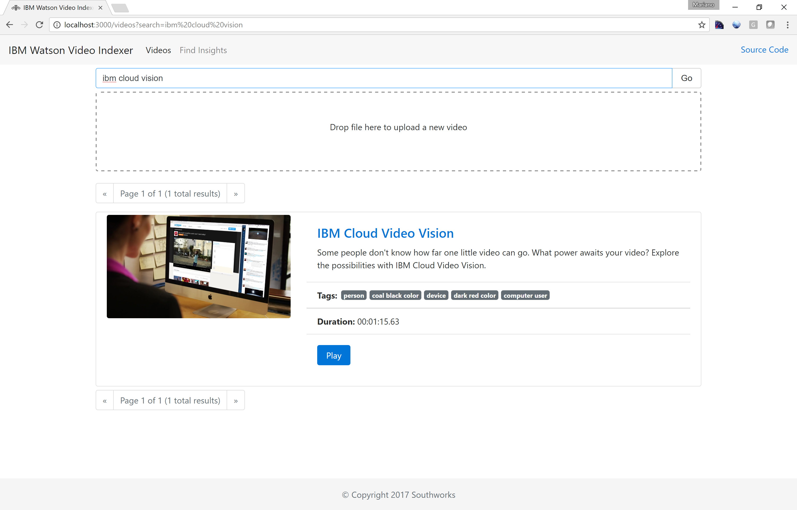
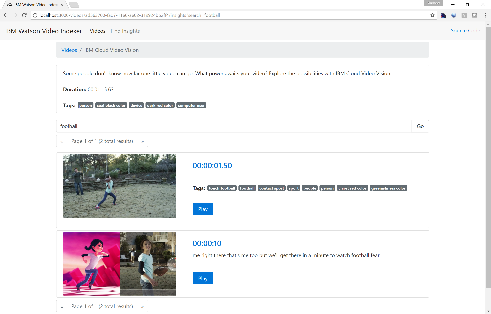
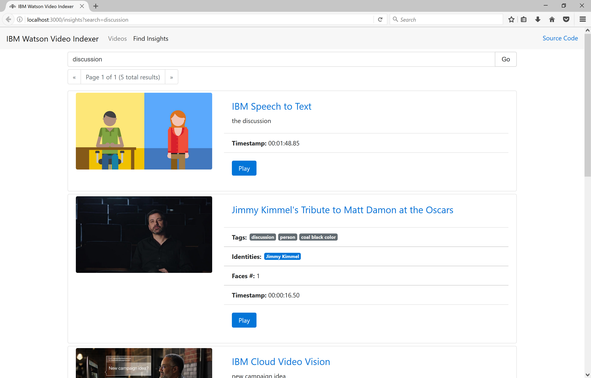
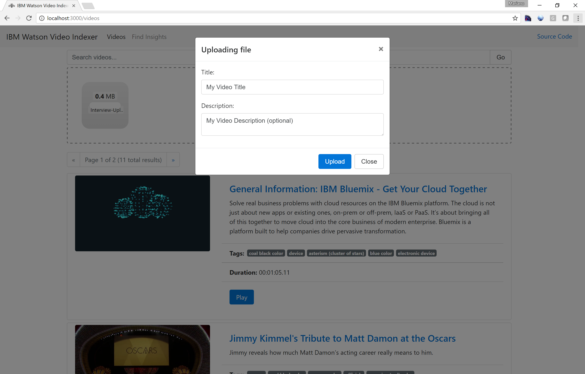

# IBM Watson Video Indexer

This is proof-of-concept sample application that uses IBM Bluemix services to automatically index video files by analyzing the video frames (tag clasification, face and identity detection, and text recognition) and the audio track (speech to text recognition).

You can run full-text search queries on the metadata (title, description, tags summary and identities summary) to find a video in your library.

  

You can click a particular video to navigate its details page and then find insights 'inside' the video content leveraging the metadata generated by IBM Watson services (tag clasification, face and identities, OCR and audio speech).

  

Or you can click _Find Insights_ in the navigation bar to find insights 'inside' the content of all your videos.

  

To upload a new video just drag-and-drop the file in the drop zone. In the _Uploading file_ dialog enter a _Title_ and _Descritpion_ (optional), click _Upload_ and then wait until the process completes.

***Note***: *Given to the [OpenWhisk 5 minutes maximum action timeout system limit](https://console.ng.bluemix.net/docs/openwhisk/openwhisk_reference.html#openwhisk_syslimits_timeout), make sure to upload videos that are up to 5 minutes long; otherwise, the OpenWhisk action running the speech analyzer processor will timeout and the video won't be fully indexed.*

  

## Overview

 Built using IBM Bluemix, the application uses:
  * [Watson Visual Recognition](https://console.ng.bluemix.net/catalog/services/watson_vision_combined)
  * [Watson Speech to Text](https://console.ng.bluemix.net/catalog/services/speech-to-text)
  * [OpenWhisk](https://console.ng.bluemix.net/openwhisk)
  * [Compose for Elasticsearch](https://console.ng.bluemix.net/catalog/services/compose-for-elasticsearch)
  * [Cloud Object Storage](https://console.ng.bluemix.net/catalog/infrastructure/cloud_object_storage)

## Application Requirements

* IBM Bluemix account. [Sign up](https://console.ng.bluemix.net/?cm_mmc=GitHubReadMe) for Bluemix, or use an existing account.
* Docker Hub account. [Sign up](https://hub.docker.com/) for Docker Hub, or use an existing account.
* Node.js >= 6.7.0

## Preparing the environment

### Create the Bluemix Services

***Note***: *if you have existing instances of these services, you don't need to create new instances.
You can simply reuse the existing ones.*

1. Open the IBM Bluemix console

1. Create a Compose for Elasticsearch service instance.

1. Create a Watson Visual Recognition service instance.

1. Create a Watson Speech to Text service instance.

1. Create a Cloud Object Storage (S3 API) service instance.

1. Navigate to the Cloud Object Storage details page and make sure to create a new bucked called **media**. 

### Configure the Bluemix Services credentials

1. Change to the **web/server/lib** directory.

1. Replace the placeholders in the **config-elasticsearch-credentials.json** file with the Compose for Elasticsearch service instance credentials.

1. Replace the placeholders in the **config-visual-recognition-credentials.json** file with the Watson Visual Recognition service instance credentials.

1. Replace the placeholders in the **config-speech-to-text-credentials.json** file with the Watson Speech to Text service instance credentials.

1. Replace the placeholders in the **config-s3-credentials.json** file with the Cloud Object Storage (S3 API) service instance credentials.

1. Replace the placeholders in the **config-openwhisk-credentials.json** file with the [OpenWhisk CLI credentials](https://console.ng.bluemix.net/openwhisk/learn/cli).

### Build the Docker images for the visual and speach analyzers

These analyzers requires [ffmpeg](https://ffmpeg.org/) to extract audio, frames and metadata from the video. ffmpeg is not available to an OpenWhisk action written in JavaScript or Swift. Fortunately OpenWhisk allows to write an action as a Docker image and can retrieve this image from Docker Hub.

To build the images, follow these steps:

1. Change to the ***processors*** directory.

1. Ensure your Docker environment works and that you have logged in Docker hub.

1. Run the following commands

  ```
  ./buildAndPushVisualAnalyzer.sh %youruserid%/%yourvisualanalyzerimagename%
  ./buildAndPushSpeechAnalyzer.sh %youruserid%/%yourspeechanalyzerimagename%
  ```
  Note: On some systems these commands need to be run with `sudo`.

1. After a while, your images will be available in Docker Hub, ready for OpenWhisk.

### Deploy OpenWhisk Actions

1. Ensure your [OpenWhisk command line interface](https://new-console.ng.bluemix.net/openwhisk/cli) is property configured with:

  ```
  wsk list
  ```

  This shows the packages, actions, triggers and rules currently deployed in your OpenWhisk namespace.

1. Create the **visualAnalyzer** action.

  ```
  wsk action create -t 300000 -m 512 --docker visualAnalyzer %youruserid%/%yourvisualanalyzerimagename%
  ```

1. Create the **speechAnalyzer** action.

  ```
  wsk action create -t 300000 -m 512 --docker speechAnalyzer %youruserid%/%yourspeechanalyzerimagename%
  ```

1. Create the **videoAnalyzer** sequence.

  ```
  wsk action create -t 300000 -m 512 videoAnalyzer --sequence /%yourorganization%/visualAnalyzer,/%yourorganization%/speechAnalyzer
  ```

### Deploy the web interface

This web interface is used to upload the videos, visualize the results and perform full-text search queries to find insights in the content.

1. Change to the **web** directory.

1. Get the dependencies and build the application

  ```
  npm install && npm run build
  ```

1. Push the application to Bluemix:

  ```
  cf push
  ```


  **That's it! Use the deployed web application to upload videos, monitor the processing progress, view the results and find insights inside your content!**